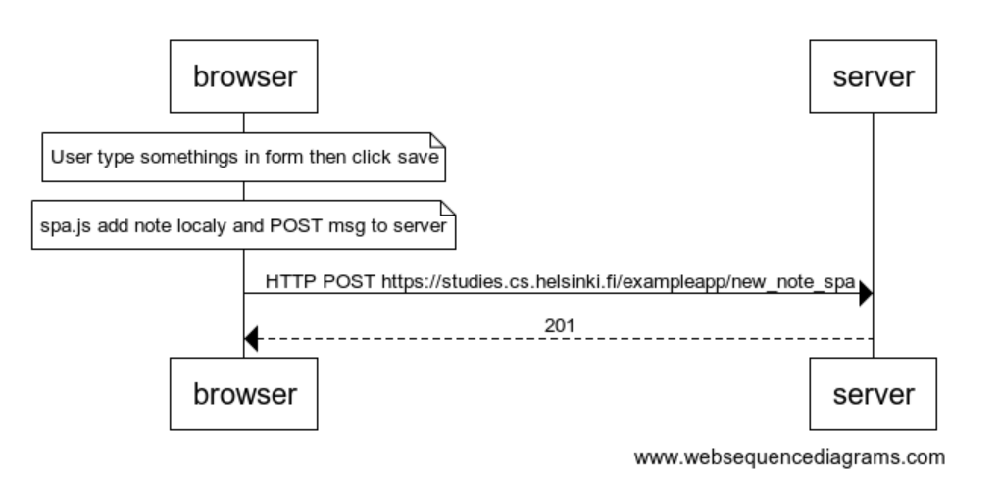

# 0.6: New note



<https://www.websequencediagrams.com/>

```mermaid
note over browser:
User type somethings in form then click save
end note

note over browser:
spa.js add note localy and POST msg to server
end note

browser->server: HTTP POST https://studies.cs.helsinki.fi/exampleapp/new_note_spa
server-->browser: 201

```
